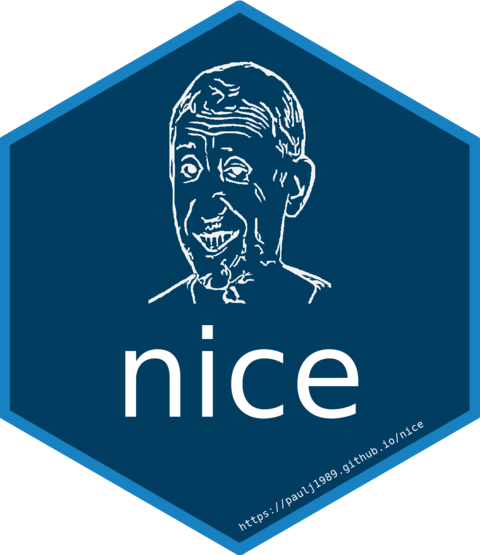

# nice <a href="https://paulj1989.github.io/nice/"></a>

<!-- badges: start -->
[](https://lifecycle.r-lib.org/articles/stages.html#experimental)
<!-- badges: end -->

This surely qualifies as the stupidest R package ever created.

Have you ever wondered whether you've made anything nice in R? No probably not. No one ever makes anything nice. We just make errors. But in the midst of all the mistakes, maybe you'd like some sweet relief. Maybe checking whether there's a 69 anywhere in your outputs?


You can't say I didn't warn you that this package is stupid!

## Installation & Usage

To install nice:

```R
install.packages("devtools")
devtools::install_github("paulj1989/nice")
```

To check if your outputs are noiiiiiiice:

```R
nice::check(x)
```

You can also check if there's anything nice in your data frame:

```R
nice::check_df(df)
```

## Development

I only did this because I'm an infant and it seemed funny at the time, but I'm probably going to continue adding to the functions because it's a good way of playing around with package development and testing things out. Soon you'll be able to check every possible R output for some niceness.

I won't be submitting this to CRAN because there are limits to how far I'll go to make a dumb joke. Please enjoy.

## License

All of this nonsense is licensed under the [MIT license](LICENSE.md). Feel free to do what you want with it!

## Contact

If for some god-forsaken reason you want to contact [me](https://github.com/paulj1989), you can do so by [email](mailto:paul@paulrjohnson.net) or on [Twitter](https://twitter.com/paul_johnson89).
